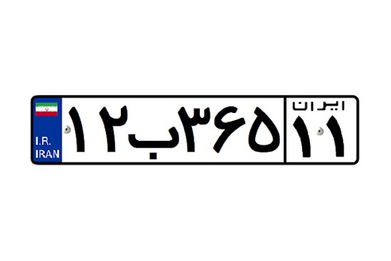

# Plate Data Processing



This repository contains a Python script for processing plate data from XML files. It includes a comprehensive guide on how to use the script, dependencies, and an example.

## Table of Contents

- [Introduction](#introduction)
- [Installation](#installation)
- [Usage](#usage)
- [Dependencies](#dependencies)
- [Example](#example)
- [Contributing](#contributing)
- [About the Author](#About)

## Introduction

Plate Data Processing is a Python script designed to extract and manipulate data from XML files containing plate information. It converts the data into a more accessible format and copies the related images for further analysis or processing. This code is made for Iranian license plates to convert the Persian classes in the xml file to the yolot file.

## Installation

1. Clone the repository:

   ```bash
   git clone https://github.com/your-username/plate-data-processing.git
   cd plate-data-processing
   pip install -r requirements.txt
   ```
   
## Usage
Modify the images and output_pass variables in the script to specify the input and output directories.
Run the script using Python:

```bash
python plate_data_processing.py
```

## Dependencies
os: Provides a portable way to use operating system-dependent functionality.
shutil: Offers a higher-level interface for file operations.
xmltodict: Converts XML data to Python dictionaries.

## Example
Suppose you have XML files containing plate data in the directory E:/plate/train/x. To process this data and generate text files along with associated images in the directory E:/plate/train2, run the script as described in the Usage section.

## Contributing
Contributions are welcome! Please feel free to fork the repository and submit pull requests to suggest improvements or additional features.


## About the Author
## About the Author

**Majid Nargesi** is a passionate programmer interested in computer vision and machine learning. You can find more about them on their [LinkedIn](https://www.linkedin.com/in/majid-nargesi).

